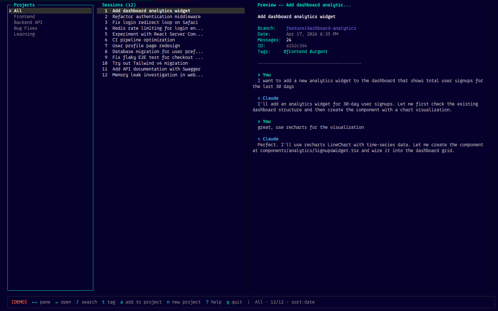

# claude-code-sessions

> Organize your Claude Code conversations. Find them again. Actually use them.

[](https://www.npmjs.com/package/claude-code-sessions)
[](https://github.com/nikkhildev/claude-sessions/blob/main/LICENSE)

## Why?

If you use [Claude Code](https://docs.anthropic.com/en/docs/claude-code), you know the pain:

- You had a great conversation last week about that auth bug → **can't find it**
- You've accumulated 100+ sessions → **no way to organize them**
- The built-in `/resume` picker shows only session IDs and first prompts → **no search, no folders, no tags**

**Unlike [Claude.ai](https://claude.ai), Claude Code has no Projects or Folders.** Your conversations are a flat pile of JSONL files.

This tool fixes that.

---

## Screenshot



Three panes — Projects on the left, Sessions in the middle, live Preview on the right. Navigate with arrow keys, search with `/`, open with Enter.

---

## Install

```bash
npm install -g claude-code-sessions
```

Requires Node.js 18+ and Claude Code already installed.

---

## Quick Start

Just run:

```bash
claude-sessions
```

That's it. The interactive browser opens.

### Keyboard shortcuts

| Key | What it does |
|-----|--------------|
| `← →` | Switch between panes |
| `↑ ↓` | Move up/down in focused pane |
| `Enter` | Open highlighted session in Claude Code |
| `/` | Search across all conversation content |
| `Esc` | Clear search |
| `s` | Cycle sort: date / messages / branch |
| `t` | Add tags to selected session |
| `T` | Remove a tag |
| `n` | Create a new project |
| `a` | Add selected session to a project |
| `r` | Remove session from active project |
| `?` | Help overlay |
| `q` | Quit |

---

## What you can do

### 📁 Group sessions into projects (like Claude.ai folders)

```bash
claude-sessions project create "Sprint 5 - Auth Refactor"
claude-sessions project add "Sprint 5 - Auth Refactor" abc123 def456
```

Or do it entirely from the TUI: press `n` to create, `a` to add a session.

### 🔍 Actually search your conversations

```bash
claude-sessions search "rate limiting"
```

Full-text fuzzy search across every message you've ever sent Claude, not just titles.

### 🏷️ Tag anything

```bash
claude-sessions tag abc123 bug critical sprint-5
claude-sessions list --tag critical
```

### 📋 Power-user CLI commands

```bash
claude-sessions list --branch auth --since 7d   # recent auth work
claude-sessions list --sort messages            # longest sessions first
claude-sessions show abc123 --full              # view full conversation
claude-sessions open abc123                     # jump into Claude Code
claude-sessions list --json | jq '.[0].id'      # scriptable
```

Run `claude-sessions --help` to see everything.

---

## How it works

- Reads Claude Code's session storage at `~/.claude/projects/` — **strictly read-only**
- Stores your custom tags, names, and projects in a sidecar file at `~/.claude-sessions/metadata.json`
- **Never modifies Claude's files.** Safe to use alongside any Claude Code version.

---

## Why I built this

Claude.ai has Projects. Claude Code doesn't. I had 280+ conversations and couldn't find anything.

There's an open [feature request](https://github.com/anthropics/claude-code/issues/50031) to add session organization to Claude Code officially. Until that ships, this tool fills the gap.

---

## Contributing

Bug reports, feature requests, and PRs welcome at [github.com/nikkhildev/claude-sessions](https://github.com/nikkhildev/claude-sessions).

## License

MIT
